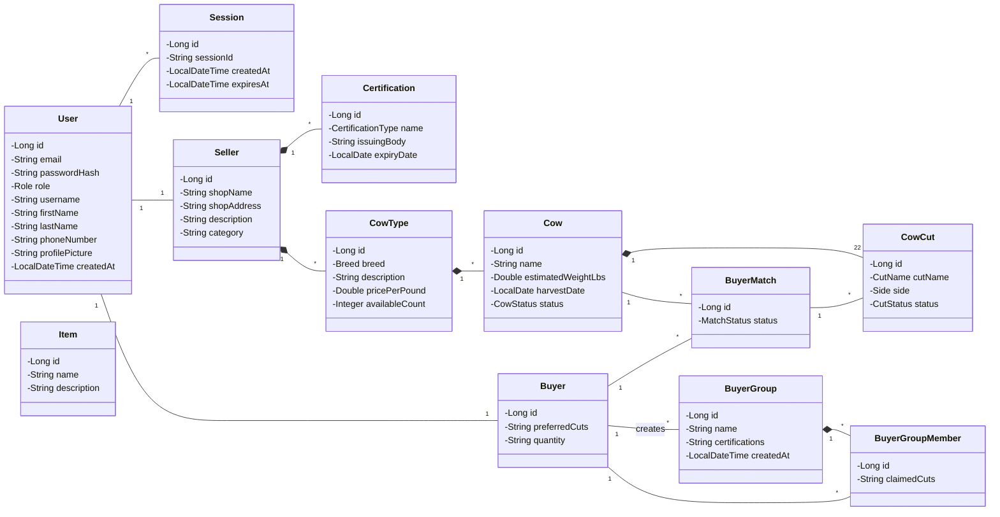

```mermaid


classDiagram
    direction LR

    class User {
        -Long id
        -String email
        -String passwordHash
        -Role role
        -String username
        -String firstName
        -String lastName
        -String phoneNumber
        -String profilePicture
        -LocalDateTime createdAt
    }

    class Session {
        -Long id
        -String sessionId
        -LocalDateTime createdAt
        -LocalDateTime expiresAt
    }

    class Buyer {
        -Long id
        -String preferredCuts
        -String quantity
    }

    class Seller {
        -Long id
        -String shopName
        -String shopAddress
        -String description
        -String category
    }

    class Certification {
        -Long id
        -CertificationType name
        -String issuingBody
        -LocalDate expiryDate
    }

    class CowType {
        -Long id
        -Breed breed
        -String description
        -Double pricePerPound
        -Integer availableCount
    }

    class Cow {
        -Long id
        -String name
        -Double estimatedWeightLbs
        -LocalDate harvestDate
        -CowStatus status
    }

    class CowCut {
        -Long id
        -CutName cutName
        -Side side
        -CutStatus status
    }

    class BuyerMatch {
        -Long id
        -MatchStatus status
    }

    class BuyerGroup {
        -Long id
        -String name
        -String certifications
        -LocalDateTime createdAt
    }

    class BuyerGroupMember {
        -Long id
        -String claimedCuts
    }

    class Item {
        -Long id
        -String name
        -String description
    }

    User "1" -- "1" Buyer
    User "1" -- "1" Seller
    User "1" -- "*" Session
    Seller "1" *-- "*" Certification
    Seller "1" *-- "*" CowType
    CowType "1" *-- "*" Cow
    Cow "1" *-- "22" CowCut
    Cow "1" -- "*" BuyerMatch
    Buyer "1" -- "*" BuyerMatch
    BuyerMatch "1" -- "*" CowCut
    Buyer "1" -- "*" BuyerGroup : creates
    BuyerGroup "1" *-- "*" BuyerGroupMember
    Buyer "1" -- "*" BuyerGroupMember
```
