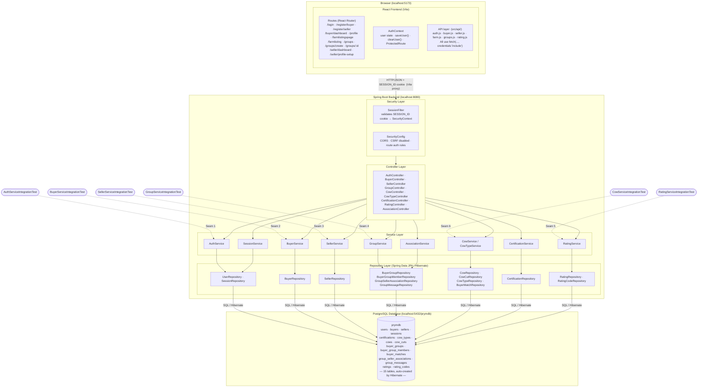

# PRYM — Revised Architecture Diagram with Integration Test Seams

This is a revised version of the ITR2 architecture diagram. It preserves the same layered structure and adds two things:
1. New components introduced since ITR2 (RatingController, AssociationController, RatingService, AssociationService, new repositories and tables)
2. **Integration test seams** — dashed arrows showing which test class exercises each Service ↔ Database boundary

Integration tests `@Autowired` the Spring Service directly, bypassing the HTTP, Security, and Controller layers entirely, then run against the real PostgreSQL database (`prymdb`). Each dashed arrow is a seam.

---

---

## Integration Test Seam Summary

| Seam | Integration Test Class | Service Under Test | Repositories Exercised |
|------|------------------------|--------------------|------------------------|
| 1 | `AuthServiceIntegrationTest` | `AuthService` | `UserRepository` |
| 2 | `BuyerServiceIntegrationTest` | `BuyerService` | `BuyerRepository` |
| 3 | `SellerServiceIntegrationTest` | `SellerService` | `SellerRepository` |
| 4 | `GroupServiceIntegrationTest` | `GroupService` | `BuyerGroupRepository`, `BuyerGroupMemberRepository` |
| 5 | `RatingServiceIntegrationTest` | `RatingService` | `RatingRepository`, `RatingCodeRepository` |
| 6 | `CowServiceIntegrationTest` | `CowService` / `CowTypeService` | `CowRepository`, `CowCutRepository`, `CowTypeRepository` |

### What each seam tests

**Seam 1 — AuthService ↔ DB**
Verifies that user registration persists to the database, that unique constraints on email and username are enforced by the real DB, that passwords are hashed (not stored in plaintext), and that the full register → login flow works end-to-end.

**Seam 2 — BuyerService ↔ DB**
Verifies that buyer profiles are created and linked to the correct `User` row, that duplicate profiles are rejected, and that profile updates (preferred cuts, phone number) are persisted correctly.

**Seam 3 — SellerService ↔ DB**
Verifies that seller profiles are created, retrieved, and updated correctly in the database, and that `getAllFarms()` reflects newly inserted rows.

**Seam 4 — GroupService ↔ DB**
Verifies that groups are created with the correct name/certifications, that membership is tracked across multiple buyers, that cut-claiming respects per-cut slot limits, and that leaving/deleting groups cascades correctly.

**Seam 5 — RatingService ↔ DB**
Verifies the full generate-code → submit-rating flow against the real DB, that the running average is computed correctly across multiple ratings, that used codes are atomically marked and rejected on reuse, and that duplicate ratings per seller are blocked.

**Seam 6 — CowService ↔ DB**
Verifies that creating a cow auto-generates exactly 22 `CowCut` records (11 cut names × LEFT + RIGHT sides), all starting as `AVAILABLE`, and that `getCowsBySeller` correctly scopes results to a single seller.

---

## Changes from ITR2 Architecture

| Component | Change |
|-----------|--------|
| `RatingController` | Added — handles rating code generation and rating submission |
| `AssociationController` | Added — handles group ↔ seller association lifecycle |
| `RatingService` | Added |
| `AssociationService` | Added |
| `RatingRepository`, `RatingCodeRepository` | Added |
| `GroupSellerAssociationRepository`, `GroupMessageRepository` | Added |
| `ratings`, `rating_codes` tables | Added |
| `group_seller_associations`, `group_messages` tables | Added |
| Table count | 12 → 15 |
